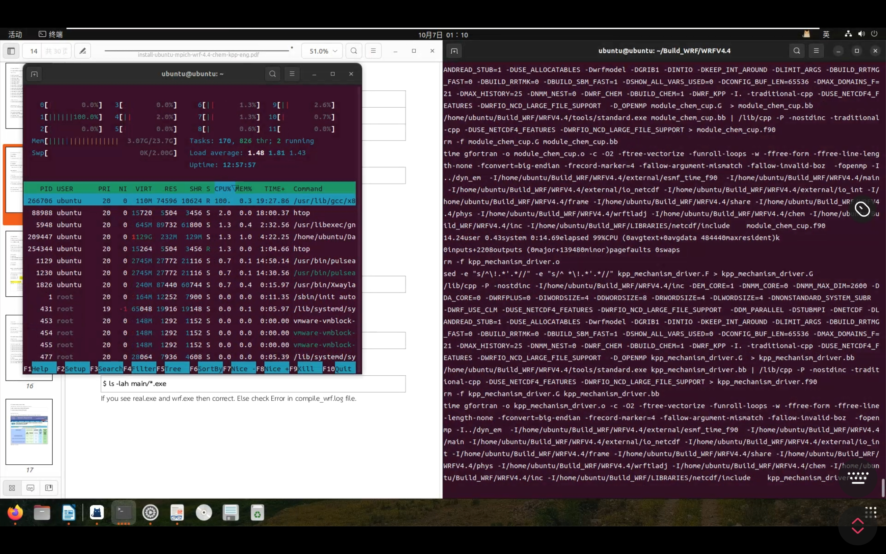
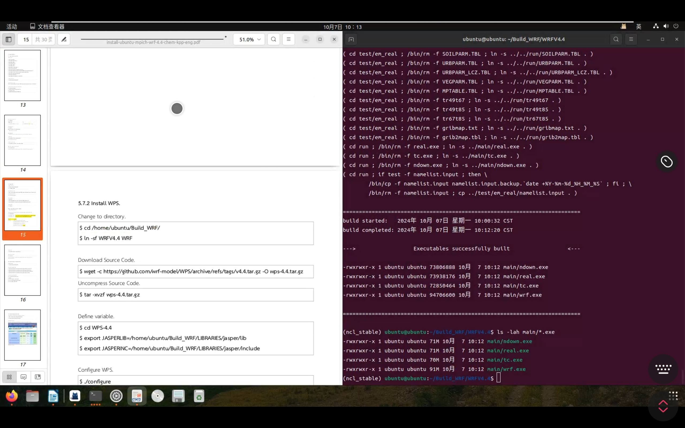
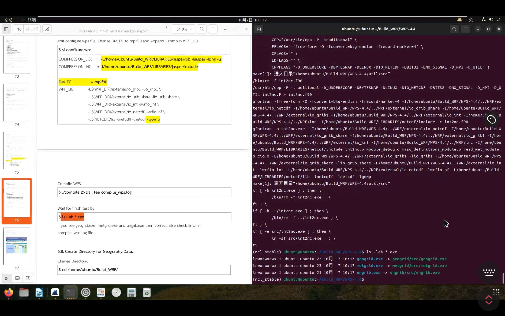
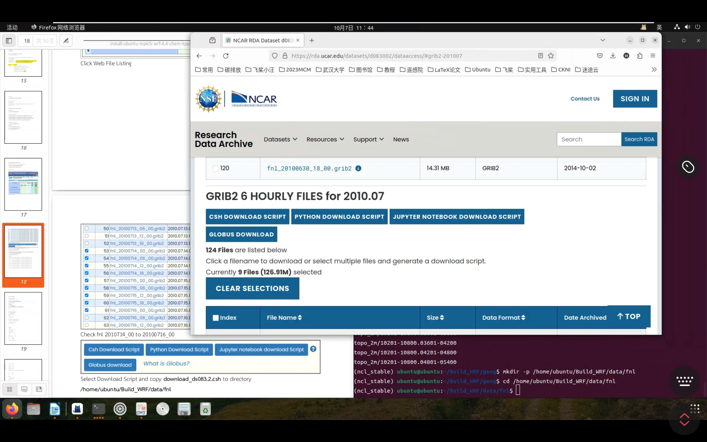

# WRF-CHEM
WRF-CHEM installation on Ubuntu 22.04

## 1. Prepare 准备工作
### 1.1 Log in and check name
```bash
# show ubuntu version.
cat /etc/os-release
# show user name.
whoami
```

### 1.2 Update
```bash
# update repository.
sudo apt update
```

### 1.3 Intall libs
```bash
sudo apt install csh m4 build-essential nasm cmake unzip libxmu-dev libcairo-dev libbz2-dev libxaw7-dev libx11-dev xorg-dev flex bison subversion liburi-perl evince tcsh cpp quota cvs libomp-dev python3-pip freeglut3-dev libjpeg-dev file vim
```

### 1.4 Install Compiler
```bash
# install compiler.
sudo apt install gcc g++ gfortran
# show compiler version.
gcc -v
g++ -v
gfortran -v
cpp --version
```

## 2. Libraries Installation 安装库文件

### 2.1 Install mpich
```bash
# Create directory
mkdir -p /home/ubuntu/Build_WRF/src
mkdir -p /home/ubuntu/Build_WRF/LIBRARIES
cd /home/ubuntu/Build_WRF/src
```
Download Source Code. (provided)  下载源码（已提供）
```bash
wget https://www.mpich.org/static/downloads/4.0.2/mpich-4.0.2.tar.gz
```
Uncompress Source Code and Compile. 解压源码并编译
```bash
tar -xzvf mpich-4.0.2.tar.gz
cd mpich-4.0.2
FFLAGS=-fallow-argument-mismatch FCFLAGS=-fallow-argument-mismatch ./configure --prefix=/home/ubuntu/Build_WRF/LIBRARIES/mpich
make -j4
make install
```
Update PATH variables 更新PATH变量
```bash
vim /home/ubuntu/.profile
```
```text
### mpich
export PATH=/home/ubuntu/Build_WRF/LIBRARIES/mpich/bin:$PATH
```
```bash
source /home/ubuntu/.profile
```

### 2.2 Install zlib
```bash
cd /home/ubuntu/Build_WRF/src
```
```bash
wget http://www.zlib.net/fossils/zlib-1.2.12.tar.gz
```
Uncompress Source Code and Compile. 解压源码并编译
```bash
tar xzvf zlib-1.2.12.tar.gz
cd zlib-1.2.12
./configure --prefix=/home/ubuntu/Build_WRF/LIBRARIES/zlib
make -j4
make install
```

### 2.3 Install hdf5
```bash
cd /home/ubuntu/Build_WRF/src
```
```bash
wget https://hdf-wordpress-1.s3.amazonaws.com/wp-content/uploads/manual/HDF5/HDF5_1_12_2/source/hdf5-1.12.2.tar.gz
```
Uncompress Source Code and Compile. 解压源码并编译
```bash
tar xzvf hdf5-1.12.2.tar.gz
cd hdf5-1.12.2
./configure --prefix=/home/ubuntu/Build_WRF/LIBRARIES/hdf5 --with-zlib=/home/ubuntu/Build_WRF/LIBRARIES/zlib --enable-fortran --enable-fortran2003 --enable-cxx --with-default-api-version=v18
make -j4
make install
```
Update PATH variables 更新PATH变量
```bash
vim /home/ubuntu/.profile
```
```text
### hdf5
export PATH=/home/ubuntu/Build_WRF/LIBRARIES/hdf5/bin:$PATH
export LD_LIBRARY_PATH=/home/ubuntu/Build_WRF/LIBRARIES/hdf5/lib:$LD_LIBRARY_PATH
```
```bash
source /home/ubuntu/.profile
```
### 2.4 Install curl
```bash
cd /home/ubuntu/Build_WRF/src
```
```bash
wget https://curl.se/download/curl-7.83.1.tar.gz
```
Uncompress Source Code and Compile. 解压源码并编译
```bash
tar xzvf curl-7.83.1.tar.gz
cd curl-7.83.1
./configure --prefix=/home/ubuntu/Build_WRF/LIBRARIES/curl --with-zlib=/home/ubuntu/Build_WRF/LIBRARIES/zlib --without-ssl
make -j4
make install
```

### 2.5 Install netcdf
```bash
cd /home/ubuntu/Build_WRF/src
```
Download Source Code.
```bash
wget ftp://ftp.unidata.ucar.edu/pub/netcdf/netcdf-c-4.8.0.tar.gz
wget ftp://ftp.unidata.ucar.edu/pub/netcdf/netcdf-fortran-4.5.3.tar.gz
```
#### 2.5.1 Install netcdf-c
Uncompress Source Code and Compile. 解压源码并编译
```bash
tar xzvf netcdf-c-4.8.0.tar.gz
cd netcdf-c-4.8.0
CFLAGS=-fPIC CPPFLAGS='-I/home/ubuntu/Build_WRF/LIBRARIES/hdf5/include -I/home/ubuntu/Build_WRF/LIBRARIES/curl/include' LDFLAGS='-L/home/ubuntu/Build_WRF/LIBRARIES/hdf5/lib -L/home/ubuntu/Build_WRF/LIBRARIES/curl/lib ' ./configure --prefix=/home/ubuntu/Build_WRF/LIBRARIES/netcdf --enable-netcdf-4 --enable-netcdf4 --enable-shared --enable-dap
make -j4
make install
cd ..
```
#### 2.5.2 Install netcdf-fortran
Uncompress Source Code and Compile. 解压源码并编译
```bash
tar xzvf netcdf-fortran-4.5.3.tar.gz
cd netcdf-fortran-4.5.3
CPPFLAGS='-I/home/ubuntu/Build_WRF/LIBRARIES/netcdf/include' LDFLAGS='-L/home/ubuntu/Build_WRF/LIBRARIES/netcdf/lib' FCFLAGS='-m64' ./configure --prefix=/home/ubuntu/Build_WRF/LIBRARIES/netcdf
make -j4
make install
```
Update PATH variables 更新PATH变量
```bash
vim /home/ubuntu/.profile
```
```text
### netcdf
export PATH=/home/ubuntu/Build_WRF/LIBRARIES/netcdf/bin:$PATH
export NETCDF=/home/ubuntu/Build_WRF/LIBRARIES/netcdf
export LD_LIBRARY_PATH=/home/ubuntu/Build_WRF/LIBRARIES/netcdf/lib:$LD_LIBRARY_PATH
```
```bash
source /home/ubuntu/.profile
```
### 2.6 Install libpng
```bash
cd /home/ubuntu/Build_WRF/src
```
```bash
wget https://jaist.dl.sourceforge.net/project/libpng/libpng16/1.6.37/libpng-1.6.37.tar.gz
```
Uncompress Source Code and Compile. 解压源码并编译
```bash
tar xzvf libpng-1.6.37.tar.gz
cd libpng-1.6.37
CPPFLAGS='-I/home/ubuntu/Build_WRF/LIBRARIES/netcdf/include' FCFLAGS='-m64' ./configure --prefix=/home/ubuntu/Build_WRF/LIBRARIES/libpng
make -j4
make install
```
Update PATH variables 更新PATH变量
```bash
vim /home/ubuntu/.profile
```
```text
#### jasper
export PATH=/home/ubuntu/Build_WRF/LIBRARIES/jasper/bin:$PATH
export LD_LIBRARY_PATH=/home/ubuntu/Build_WRF/LIBRARIES/jasper/lib:$LD_LIBRARY_PATH
```
```bash
source /home/ubuntu/.profile
```
### 2.7 Install ncl
```bash
cd /home/ubuntu/Build_WRF/src
```
Install miniconda.
```bash
wget https://repo.anaconda.com/miniconda/Miniconda3-latest-Linux-x86_64.sh
sh ./Miniconda3-latest-Linux-x86_64.sh
```
Install ncl.
```bash
source /home/ubuntu/.bashrc
conda create -n ncl_stable -c conda-forge ncl # 创建Conda环境
source activate ncl_stable
```
Test ncl. 测试ncl工具
```bash
ncl -V
```
Show version 6.6.2 is good.
Update PATH variables 更新PATH变量
```bash
vim /home/ubuntu/.profile
```
```text
#### ncl
source activate ncl_stable
```
```bash
source /home/ubuntu/.profile
```
## 3. Install WRF
### WRF-chem and KPP
Variable setup. 设置变量
```bash
ulimit -s unlimited
export MALLOC_CHECK_=0
export EM_CORE=1
export NMM_CORE=0
export WRF_CHEM=1
export WRF_KPP=1
export YACC='/usr/bin/yacc -d'
export FLEX=/usr/bin/flex
export FLEX_LIB_DIR=/usr/lib/x86_64-linux-gnu
export KPP_HOME=/home/ubuntu/Build_WRF/WRFV4.4/chem/KPP/kpp/kpp-2.1
export WRF_SRC_ROOT_DIR=/home/ubuntu/Build_WRF/WRFV4.4
export PATH=$KPP_HOME/bin:$PATH
export SED=/usr/bin/sed
export WRFIO_NCD_LARGE_FILE_SUPPORT=1
```

```bash
cd /home/ubuntu/Build_WRF/
```

```bash
wget -c https://github.com/wrf-model/WRF/releases/download/v4.4/v4.4.tar.gz -O wrf-4.4.tar.gz
```
Uncompress Source Code and Compile. 解压源码并编译
```bash
tar -xvzf wrf-4.4.tar.gz
cd WRFV4.4/chem/KPP/kpp/kpp-2.1/src
/usr/bin/flex scan.l
cd /home/ubuntu/Build_WRF/WRFV4.4
```
```bash
vim configure
```
| Change from | To |
|:------:|:-------:|
| if [ "$USENETCDFPAR" == "1" ] ; then | if [ "$USENETCDFPAR" **=** "1" ] ; then|
```bash
./configure
```
Enter selection [1-75] : **33**  
Compile for nesting? (1=basic, 2=preset moves, 3=vortex following) [default 1]: **1**  

Complie kpp.
```bash
./compile 2>&1 | tee compile_kpp.log
```
Complie em_real mode.
```bash
./compile em_real 2>&1 | tee compile_wrf.log # 等待30-50min（根据电脑性能）
```

这一步所需要的时间较长，需要耐心等待。  
Wait 30-50 minutes for finish test by
```bash
ls -lah main/*.exe 
```


如图中所示，出现这些.exe文件即表示WRF安装成功！  
If you see real.exe and wrf.exe then correct. Else check Error in compile_wrf.log file.


